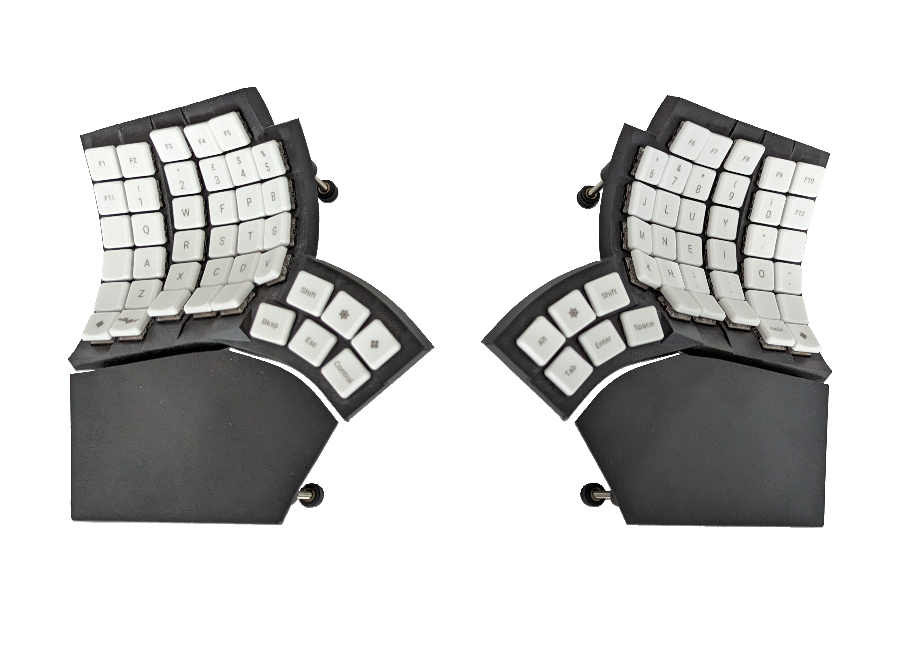

# My custom ZMK config for the MoErgo Glove80

This repo contains my current keyboad config for my Glove80. It is based on the [official MoErgo Glove80 ZMK configuration](https://github.com/moergo-sc/glove80-zmk-config) and was initially built using MoErgo's [official Layout Editor](https://my.glove80.com), however now it is maintained using @nickcoutsos's excellent [Keymap Editor](https://github.com/nickcoutsos/keymap-editor) and the occasional manual tweaking of the `keymap` file.

The keyboard firmware is built automatically using MoErgo's Github Actionr CI Workflow. CI is also used to automatically render keymap images of each layer using @caksoylar's excellent [Keymap Drawer](https://github.com/caksoylar/keymap-drawer).

## Resources
- @nickcoutsos's [Keymap Editor](https://github.com/nickcoutsos/keymap-editor).
- @caksoylar's [Keymap Drawer](https://github.com/caksoylar/keymap-drawer).
- MoErgo's official [Layout Editor](https://my.glove80.com).
- The [official MoErgo Glove80 Support](https://moergo.com/glove80-support) web site. Glove80 documentation and other technical resources.
- The [official MoErgo Discord Server](https://moergo.com/discord). Instant conversations with other Glove80 users.

- The [official ZMK Documentation](https://zmk.dev/docs) web site. Find the answers to many of your questions about ZMK Firmware.
- The [official ZMK Discord Server](https://discord.gg/8cfMkQksSB). Instant conversations with other ZMK developers and users. Great technical resource!

- The [official Glove80 ZMK Distribution](https://github.com/moergo-sc/zmk). Repositiory for ZMK firmware customized for Glove80. 

## Layers

### Base Layers

The main base layer is Colmak DH. Some punctuation is moved around uring Mod Morphs, and usuful stuff is placed on the thunb keys.

There is a secondary Qwerty base layer available as a fallback:

### Gaming

A gaming layer extends Qwerty, shifting WASD to a more comfortable position.

### Symbols

Readily accesible from a thumb key, the symbols layer attempts to find comfortable positions for commonly used programming symbols.

### Numbers & Navigation

Also on the thumb keys, a nav layer has a comfortable numpad and navigation keys.

I may consider switching from a numpad layout to a 2x 4-finger numrow in an attempt to keep everything closer to the home row. Alternatively, moving the `0` key up may have the same effect.

### MoErgo's Magic Layer

As standard on all Glove80 keyboards, a Magic layer provider access to system utitities, such as bluetooth settings and RGB lighting config.

 
## Firmware Files
To locate your firmware files and reflash your Glove80...
1. log into GitHub and navigate to your personal config repository you just uploaded your keymap changes to.
2. Click ["Actions"](https://github.com/MattSturgeon/Glove80-Config/actions/workflows/build.yml) in the main navigation, and in the left navigation click the "Build" link.
3. Select the desired workflow run in the centre area of the page (based on date and time of the build you wish to use). You can also start a new build from this page by clicking the "Run workflow" button.
4. After clicking the desired workflow run, you should be presented with a section at the bottom of the page called "Artifacts". This section contains the results of your build, in a file called "glove80.uf2"
5. Download the glove80.uf2
6. Flash the firmware to Glove80 according to the user documentation on the official Glove80 Glove80 Support website (linked above)

Your keyboard is now ready to use.
